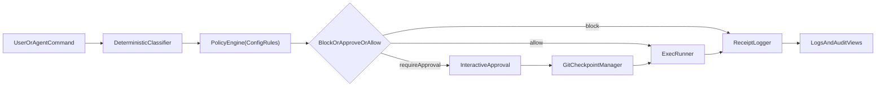

# AgentSeatbelt

Runtime firewall for AI coding agents before they touch your terminal, repo, secrets, or production.

AgentSeatbelt intercepts risky terminal actions before execution, explains risk in plain language, enforces deterministic policy decisions, captures action receipts, and creates rollback checkpoints in Git repos.

## Why now?

AI coding agents can now run shell commands, edit repositories, install packages, access secrets, and trigger deploy paths. Modern developer environments were built for human intent, not autonomous tool execution. AgentSeatbelt adds a local control layer between agent output and real system impact.

## What AgentSeatbelt protects

- Terminal execution paths before risky commands run
- Repository integrity and rollback recovery points
- Secret-bearing files and obvious credential access patterns
- Production and infra surfaces that can cause live impact

## Features (v0)

- Deterministic local risk classification (no paid APIs, no AI required)
- Policy engine with configurable rules in `.seatbelt/config.yml`
- Profiles: `dev`, `strict`, `ci`
- Interactive approval for high/critical commands
- Secret-read blocking by default (`.env`, keys, tokens)
- Git checkpoint + rollback metadata
- JSON action receipts with explainability (`matchDetails`, confidence, reason)
- Action receipt views: table, JSON, NDJSON + filters
- Dry-run simulation mode
- Doctor command for local readiness checks

## Install and run locally

```bash
npm install
npm run build
node dist/index.js --help
```

Optional local executable link:

```bash
npm link
seatbelt --help
```

## Core commands

### Initialize

```bash
seatbelt init
seatbelt init --seed-baseline
```

Creates:
- `.seatbelt/config.yml`
- `.seatbelt/logs/`
- `.seatbelt/checkpoints.json`

`--seed-baseline` is optional, local-only, disabled by default, and never uploads shell history.

### Run a command through Seatbelt

```bash
seatbelt run "echo hello"
seatbelt run "npm install" --profile strict
seatbelt run "rm -rf build" --dry-run
seatbelt run "git push origin main"
```

Risk panel output includes:
- Command
- Risk level + score
- Why risky
- Blast radius
- Policy decision
- Approval required (yes/no)
- Rollback available (yes/no)

### Action receipts

Every decision writes a local JSON action receipt for auditability and demos. Receipts include risk rationale, policy decision, approval outcome, execution status, checkpoint metadata, and `agentSessionId` when a session is active.

### View action receipts

```bash
seatbelt logs
seatbelt logs --tail 15
seatbelt logs --risk high,critical
seatbelt logs --decision block,require_approval
seatbelt logs --format json
seatbelt logs --format ndjson
```

### Roll back checkpoint

```bash
seatbelt rollback --list
seatbelt rollback
seatbelt rollback --id cp_1710000000000
```

### Environment diagnostics

```bash
seatbelt doctor
```

### Protected agent session (v0)

```bash
seatbelt agent dev
```

Creates `.seatbelt/session.json` with:
- `agentSessionId`
- workspace path
- session start time
- protected surfaces

## Config format

`.seatbelt/config.yml` example:

```yaml
rules:
  - pattern: "cat .env"
    action: block
    severity: critical
  - pattern: "rm -rf"
    action: require_approval
    severity: critical
  - pattern: "vercel --prod"
    action: require_approval
    severity: critical
profiles:
  dev:
    low: allow
    medium: allow
    high: require_approval
    critical: require_approval
  strict:
    low: allow
    medium: require_approval
    high: require_approval
    critical: block
settings:
  defaultProfile: dev
  allowBaselinePatterns: true
baselineAllowPatterns: []
```

## Why safe-by-default

- Deterministic pattern classifier and policy decisions.
- Explicitly blocks secret-read commands by default.
- Requires interactive approval for high-impact commands.
- Captures action receipts for every decision path for auditing.
- Creates Git checkpoint metadata before risky execution for faster recovery.

## Architecture



## Demo in 90 seconds

```bash
seatbelt init
seatbelt run "echo safe path"
seatbelt run "cat .env"
seatbelt run "rm -rf build" --dry-run
seatbelt run "vercel --prod" --dry-run
seatbelt logs --tail 10
seatbelt doctor
```

See also: `demo.sh` and `demo.ps1` for reproducible, safe demo runs.

## Roadmap

- Agent session mode
- MCP proxy / tool-call enforcement
- Receipt hash chaining
- CI / GitHub Actions mode
- Team policy packs
- Dashboard
- IDE integrations

## Testing

```bash
npm test
```
