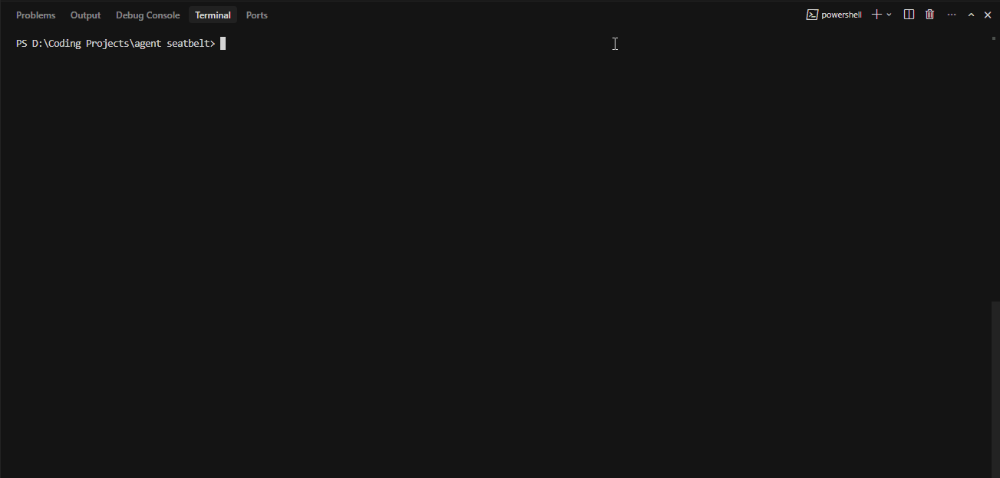

# AgentSeatbelt

Runtime firewall for AI coding agents before they touch your terminal, repo, secrets, or production.



AgentSeatbelt is a local-first CLI runtime guardrail that classifies command risk, enforces deterministic policy decisions, captures tamper-evident action receipts, and creates rollback checkpoints for Git repositories.

Built for:
- Investors evaluating category-defining AI safety infrastructure
- Senior developers shipping with AI coding agents in real repositories
- Security and DevSecOps teams requiring deterministic local controls

## Why now

AI coding agents can run shell commands, modify repositories, install dependencies, read local files, and trigger deployment paths. Developer environments were built for human intent, not autonomous execution. AgentSeatbelt adds a deterministic control layer between agent output and system impact.

## What AgentSeatbelt protects

- Terminal execution before risky commands run
- Repository integrity and rollback recovery points
- Secret-bearing paths and common credential access patterns
- Production and infrastructure command surfaces
- Workspace-scoped session context via `agentSessionId`

## Core capabilities

- Deterministic risk classification (no paid APIs)
- Rule-based policy engine with profiles (`dev`, `strict`, `ci`)
- Secret-read blocking by default
- Approval gating for high-impact actions
- Git checkpoint metadata before risky execution
- Action receipts in `json`, `ndjson`, and table views
- Receipt hash-chaining (`chainIndex`, `previousReceiptHash`, `receiptHash`)
- Protected session mode: `seatbelt agent dev`

## Security model

- Local-first runtime execution
- No telemetry
- No cloud upload of commands, receipts, or config
- Deterministic policy outcomes
- Workspace-scoped session IDs for traceable runs

## Demo in 90 seconds

```bash
seatbelt init
seatbelt run "echo safe path"
seatbelt run "cat .env"
seatbelt run "rm -rf build" --dry-run
seatbelt run "vercel --prod" --dry-run
seatbelt logs --tail 10
seatbelt doctor
```

Cross-platform scripts:
- `demo.sh`
- `demo.ps1`

## Quickstart

```bash
npm install
npm run build
node dist/index.js --help
```

Optional local link:

```bash
npm link
seatbelt --help
```

Health checks:

```bash
npm run test
npm run typecheck
npm run lint
```

## Session mode (v0)

```bash
seatbelt agent dev
```

Creates `.seatbelt/session.json` with:
- `agentSessionId`
- `workspacePath`
- `startedAt`
- `protectedSurfaces`

If a valid session already exists for the current workspace, the same `agentSessionId` is reused.

## Configuration

Default config file: `.seatbelt/config.yml`

```yaml
rules:
  - pattern: "cat .env"
    action: block
    severity: critical
  - pattern: "rm -rf"
    action: require_approval
    severity: critical
  - pattern: "vercel --prod"
    action: require_approval
    severity: critical
```

`--seed-baseline` is optional, local-only, disabled by default, and never uploads shell history.

## Professional docs

- [SECURITY.md](SECURITY.md)
- [CONTRIBUTING.md](CONTRIBUTING.md)
- [CODE_OF_CONDUCT.md](CODE_OF_CONDUCT.md)
- [SUPPORT.md](SUPPORT.md)
- [GOVERNANCE.md](GOVERNANCE.md)
- [docs/threat-model.md](docs/threat-model.md)
- [CHANGELOG.md](CHANGELOG.md)
- [RELEASE_NOTES_v0.1.0.md](RELEASE_NOTES_v0.1.0.md)

## Roadmap

- Agent session hardening
- MCP proxy / tool-call enforcement
- CI / GitHub Actions mode
- Team policy packs
- IDE integrations
