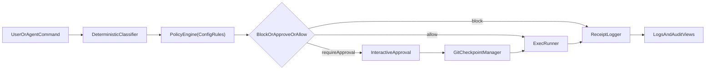

# AgentSeatbelt

AgentSeatbelt is a developer-first CLI runtime firewall for AI coding agents and humans running terminal commands.

It intercepts risky commands before execution, explains risk, enforces policy, asks for approval when needed, blocks critical secret reads by default, logs every decision, and creates rollback checkpoints for Git repositories.

## Features (v0)

- Deterministic local risk classification (no paid APIs, no AI required)
- Policy engine with configurable rules in `.seatbelt/config.yml`
- Profiles: `dev`, `strict`, `ci`
- Interactive approval for high/critical commands
- Secret-read blocking by default (`.env`, keys, tokens)
- Git checkpoint + rollback metadata
- JSON receipts with explainability (`matchDetails`, confidence, reason)
- Log views: table, JSON, NDJSON + filters
- Dry-run simulation mode
- Doctor command for local readiness checks

## Install and run locally

```bash
npm install
npm run build
node dist/index.js --help
```

Optional local executable link:

```bash
npm link
seatbelt --help
```

## Core commands

### Initialize

```bash
seatbelt init
seatbelt init --seed-baseline
```

Creates:
- `.seatbelt/config.yml`
- `.seatbelt/logs/`
- `.seatbelt/checkpoints.json`

### Run a command through Seatbelt

```bash
seatbelt run "echo hello"
seatbelt run "npm install" --profile strict
seatbelt run "rm -rf build" --dry-run
seatbelt run "git push origin main"
```

Risk panel output includes:
- Command
- Risk level + score
- Why risky
- Blast radius
- Policy decision
- Approval required (yes/no)
- Rollback available (yes/no)

### View logs

```bash
seatbelt logs
seatbelt logs --tail 15
seatbelt logs --risk high,critical
seatbelt logs --decision block,require_approval
seatbelt logs --format json
seatbelt logs --format ndjson
```

### Roll back checkpoint

```bash
seatbelt rollback --list
seatbelt rollback
seatbelt rollback --id cp_1710000000000
```

### Environment diagnostics

```bash
seatbelt doctor
```

## Config format

`.seatbelt/config.yml` example:

```yaml
rules:
  - pattern: "cat .env"
    action: block
    severity: critical
  - pattern: "rm -rf"
    action: require_approval
    severity: critical
  - pattern: "vercel --prod"
    action: require_approval
    severity: critical
profiles:
  dev:
    low: allow
    medium: allow
    high: require_approval
    critical: require_approval
  strict:
    low: allow
    medium: require_approval
    high: require_approval
    critical: block
settings:
  defaultProfile: dev
  allowBaselinePatterns: true
baselineAllowPatterns: []
```

## Why safe-by-default

- Deterministic pattern classifier and policy decisions.
- Explicitly blocks secret-read commands by default.
- Requires interactive approval for high-impact commands.
- Captures receipts for every decision path for auditing.
- Creates Git checkpoint metadata before risky execution for faster recovery.

## Architecture



## 5-minute demo script

```bash
seatbelt init
seatbelt run "echo safe path"
seatbelt run "cat .env"
seatbelt run "rm -rf build" --dry-run
seatbelt run "git push origin main"
seatbelt logs --tail 10
seatbelt rollback --list
```

## Testing

```bash
npm test
```
